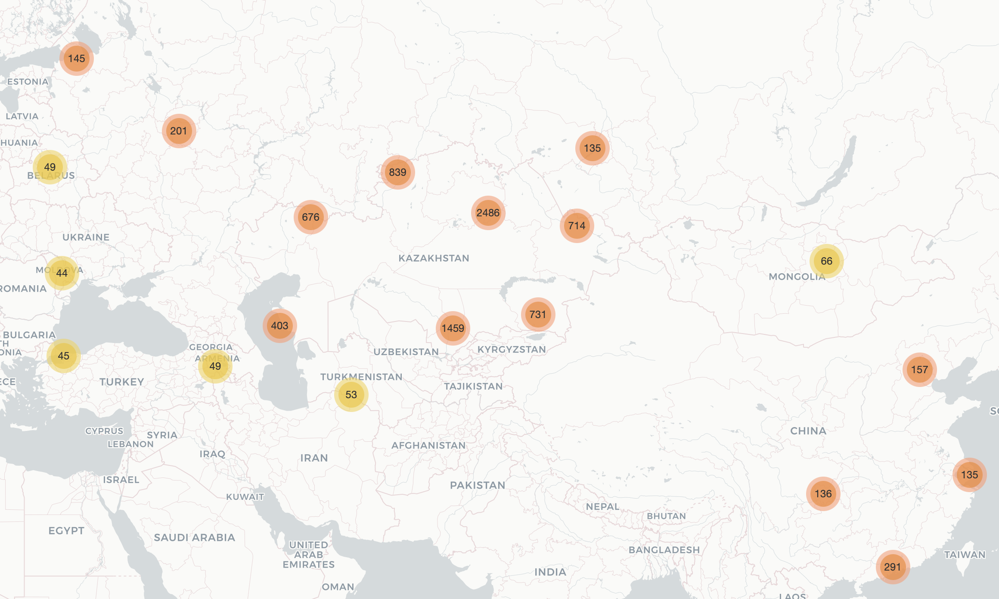
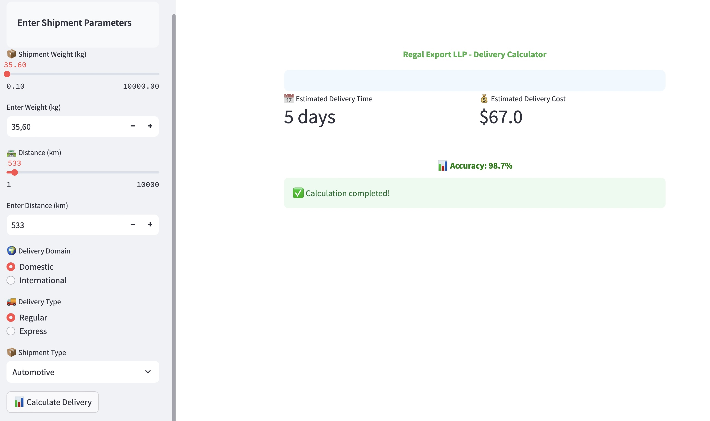

# Data Analyst|Data Scientist

## Skills
- Data Manipulation and Processing: Python (Pandas, NumPy), SQL (DML, DDL, CTE, JOINs), Excel, Google Sheets
- Data Visualization: Matplotlib, Seaborn
- Statistical Analysis (Descriptive, Hypothesis testing, A/B testing)
- Machine Learning: Regression, Clustering (Scikit-learn, TensorFlow)
- Model Deployment: Streamlit, Flask
- BI and Reporting: Power BI, Tableau, DataLens
- CRM: amoCRM, Bitrix24
- Strong Communication and Team Collaboration

## Education						       		
- MSc Strategic Engineering	| The University of Genoa (_March 2025_)	 			        		
- BSc Logictics | Eurasian National University (_June 2022_)

## Work Experience
**Sales Analyst @ Databoom LLP (_August 2024 - Present_)**
- Analyzed the sales funnel and key metrics (conversion, average check, LTV, CAC), optimized the customer interaction strategy
- Automated reports in Google Sheets and AMO CRM, set up dashboards to track the performance of managers
- Built a transaction tracking system that increased lead-to-sale conversion by 32%
- Developed customer segmentation based on purchasing behavior, increasing average check by 15% through personalized offers
- Assessed marketing channel effectiveness and identified bottlenecks, providing actionable improvements
- Implemented sales plan performance reporting, which improved transparency and helped achieve 155% of the plan in January
- Handled large datasets in Google Sheets using advanced formulas, pivot tables, and visualizations

**Industrial Data Analyst (Internship) @ Nornickel' Sputnik LLC (_August 2024 - October 2024_)**
- Built reports on crushing plant efficiency; automation increased reporting accuracy by 17%
- Designed a failure prediction model based on historical data, reaching 96% accuracy
- Analyzed repair frequency and duration, optimizing scheduling to reduce downtime by 7%
- Created predictive models for warehouse maintenance, cutting unscheduled downtime by 12%
- Reduced maintenance costs by 18% through in-depth cost analysis and optimization
- Developed interactive dashboards for management, improving decision speed by 25%

**Branch Director @ Kaz Black Star LLP (_January 2021 - September 2023_)**
- Analyzed sales and customer activity, implementing growth strategies that increased revenue by 13% in Y1 and 17% in Y2
- Built and maintained reports on key metrics (revenue, average check, traffic, shrinkage), streamlining reporting processes
- Created a stock monitoring and ordering system, reducing product losses by 25%
- Analyzed customer feedback and reduced complaints by 30%, increasing satisfaction index from 70% to 95%
- Assessed loyalty program performance and introduced improvements to enhance customer retention
- Defined and tracked team KPIs, provided insights to optimize performance

## Projects
### "Research and optimization of delivery processes based on the analysis of logistic data"
📂 [View the Project on GitHub](https://github.com/TuringAJ/project_logistic_analysis)

Project provided a comprehensive assessment of the potential of using machine learning and data analytics approaches to optimize logistics operations. The study included both theoretical and practical components, allowing to gain a deeper understanding of the fundamentals of logistics processes and develop successful optimization solutions.
The practical part of the study included structuring and studying the logistics company's data using visualization and correlation analysis methods. The data was collected and pre-processed, critical parameters affecting delivery procedures were identified, and various graphs and charts were created to visually present the information. Analysis of correlations between numerous criteria helped identify critical elements affecting delivery time and cost.
Using the collected information, models were created to predict delivery time and cost using machine learning methods. Several methods were evaluated and compared, including linear regression, random forest, and neural networks. The results of the study showed that the application of analytics and data science in logistics operations creates new opportunities to increase efficiency, reduce costs, and improve customer service. Machine learning allows to study huge amounts of data and create accurate forecasts, which is essential in constantly changing markets.

